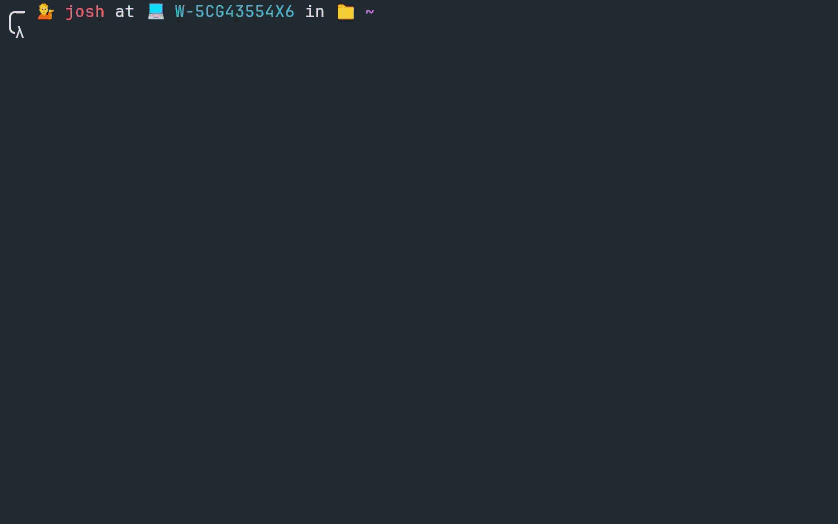

# Fate 🔮
[](https://github.com/cjd8/fate/actions/workflows/c-cpp.yml)

A joke program providing alternative, spiritually (in)accurate diagnostics for Linux
PIDs.



## What and especially why?

This program outputs a process' "horoscope" based on the supplied PID in a
horoscope-like fashion, as a homage to the Unix command `fortune`,
originally released in 1979. When entering a PID, the user will get a
daily OS-related fortune, along with a daily tarot card (special thanks to @eidamc!)
and other information. This horoscope is generated using a seed made using the
Fowler-No-Voll hash function, where the input is the PID and today's timestamp.

## Prerequisites

- CMake (min. version 3.15)
- Yes, that is all

## Installation

To install from source, clone this repository and run
```bash
cmake .
sudo make install
```

## Usage

Getting a horoscope for a single PID is simple:
```bash
fate <pid_value>
```

Additionally, there are several flags to alter the behaviour of `fate`.

| Short option | Long option | Action |
|---|---|---|
| -e  | --entropy  | Gets a random seed to generate a random value each time.  |
| -p  | --predict <pid_value> | Get horoscope of PID. Note, this can be also achieved by just entering the PID without this flag.  |
| -v  | --version  | Get program version |
| -t  | --tarot | Only prints daily tarot |
| -h  | --help  | Get program usage  |

## DAT and text files

A fortune is assembled using the following formula. These snippets are
located in the corresponding text files.

```
[SUBJECT] + [ACTION] + [TARGET].
[ADVICE]
```

As the original fortune program, `fate` also makes use of DAT files to
ensure O(1) complexity when getting random strings from the text files,
instead of scanning the file line by line until randomly stopping.

To add new strings to the files, first ensure that your new string is
separated by a '%' delimiter character. In order to generate a new DAT
file, type
```bash
strfile file_name.txt
```

The DAT and text files are by default installed in `/usr/local/share/fate/`.
